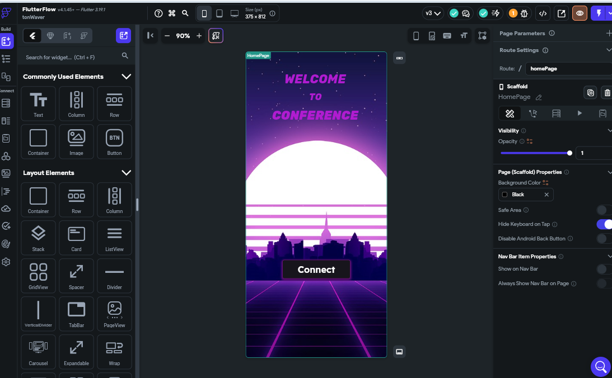
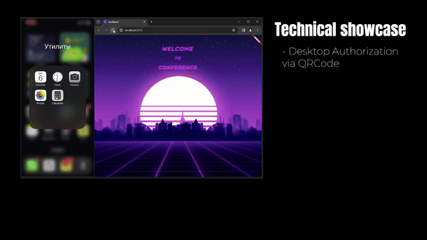
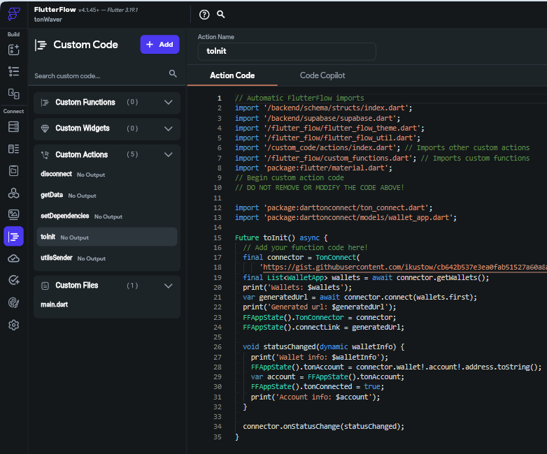
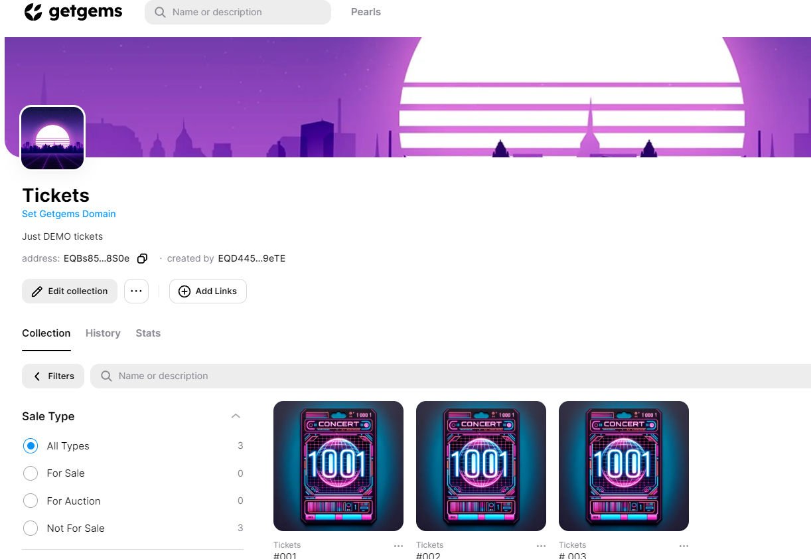
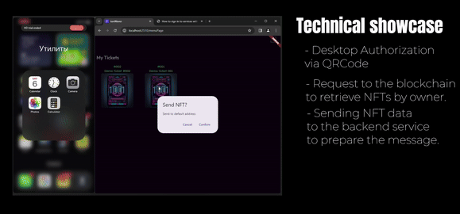
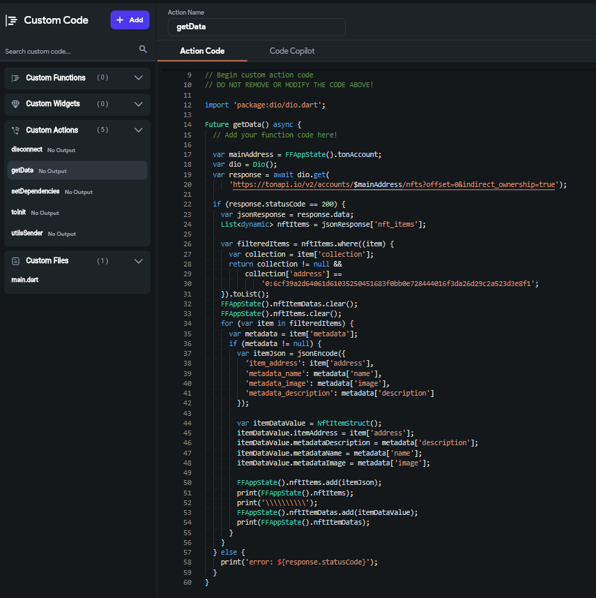
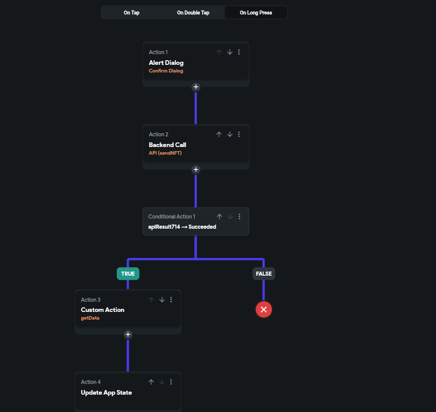
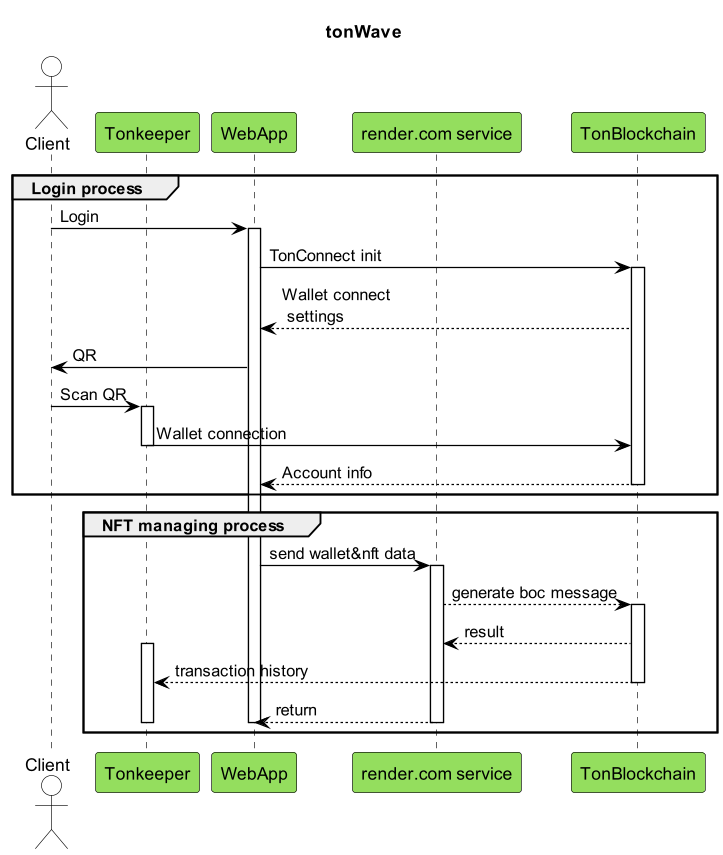
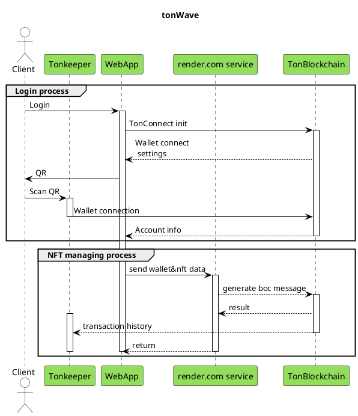

# Description
The current project is built using the Flutterflow low-code builder, a custom Python service, and hosted on the Render hosting service.

The project involves integration with the blockchain in the NFT sector, utilizing authentication through the TonKeeper wallet and sending NFTs via a custom Python service.




| Aspect                 | Tool           |
|------------------------|----------------|
| Development            | Flutterflow    |
| Custom code            | Dart           |
| Blockchain integration | TonConnect     |
| Dart library           | DartTonConnect |
| Wallet                 | TonKeeper      |
| Backend                | Supabase       |
| NFT Service            | Python         |
# Authentication 

In the example, authentication is initiated through the desktop web, and confirmation is done via a mobile phone and the TonKeeper wallet application.

## Demo 



## Custom code 

Authentication is performed using custom code functionality in the low-code platform Flutterflow, which allows integrating any Dart code. For blockchain communication, the ToNConnect option is used, which enables obtaining a QR code for authentication and linking a wallet to the application.




```dart
// DO NOT REMOVE OR MODIFY THE CODE ABOVE!

import 'package:darttonconnect/ton_connect.dart';
import 'package:darttonconnect/models/wallet_app.dart';

Future toInit() async {
  // Add your function code here!
  final connector = TonConnect(
      'https://gist.githubusercontent.com/ikustow/cb642b537e3ea0fab51527a60a8a895a/raw/b78a6d3a27fd4ab15d902e907d293b0944280221/gistfile1.txt');
  final List<WalletApp> wallets = await connector.getWallets();
  print('Wallets: $wallets');
  var generatedUrl = await connector.connect(wallets.first);
  print('Generated url: $generatedUrl');
  FFAppState().TonConnector = connector;
  FFAppState().connectLink = generatedUrl;

  void statusChanged(dynamic walletInfo) {
    print('Wallet info: $walletInfo');
    FFAppState().tonAccount = connector.wallet!.account!.address.toString();
    var account = FFAppState().tonAccount;
    FFAppState().tonConnected = true;
    print('Account info: $account');
  }

  connector.onStatusChange(statusChanged);
}
```

# NFT sending

A collection of NFTs was created and transferred to a test wallet in advance to work with NFTs, for the purpose of demonstrating the presence of multiple NFT objects.



## Demo 



## Custom code 
### Receive data
To retrieve NFTs based on the owner, an API request to the blockchain was used, targeting the collection address with a filter for the owner. Custom code and the DIO library were utilized for integration.

In this case, the owner's address is the wallet address that was used when logging into the application.



```dart
import 'package:dio/dio.dart';

Future getData() async {
  // Add your function code here!

  var mainAddress = FFAppState().tonAccount;
  var dio = Dio();
  var response = await dio.get(
      'https://tonapi.io/v2/accounts/$mainAddress/nfts?offset=0&indirect_ownership=true');

  if (response.statusCode == 200) {
    var jsonResponse = response.data;
    List<dynamic> nftItems = jsonResponse['nft_items'];

    var filteredItems = nftItems.where((item) {
      var collection = item['collection'];
      return collection != null &&
          collection['address'] ==
              '0:....2a523d3e8f1';
    }).toList();
    FFAppState().nftItemDatas.clear();
    FFAppState().nftItems.clear();
    for (var item in filteredItems) {
      var metadata = item['metadata'];
      if (metadata != null) {
        var itemJson = jsonEncode({
          'item_address': item['address'],
          'metadata_name': metadata['name'],
          'metadata_image': metadata['image'],
          'metadata_description': metadata['description']
        });

        var itemDataValue = NftItemStruct();
        itemDataValue.itemAddress = item['address'];
        itemDataValue.metadataDescription = metadata['description'];
        itemDataValue.metadataName = metadata['name'];
        itemDataValue.metadataImage = metadata['image'];

        FFAppState().nftItems.add(itemJson);
        print(FFAppState().nftItems);
        print('\\\\\\\\\\');
        FFAppState().nftItemDatas.add(itemDataValue);
        print(FFAppState().nftItemDatas);
      }
    }
  } else {
    print('error: ${response.statusCode}');
  }
}
```
### Sending data



The sending of NFTs occurs through a custom Python service provided in the current repository. On the Flutterflow application side, a message is prepared containing the NFT contract address and the new owner's address (the new owner being my second test wallet, its address is hardcoded in the application as a constant).

- [TONsdk](https://github.com/tonfactory/tonsdk) library is used for sending.

## UML 

You can see a step-by-step process of working with the TON blockchain and a custom NFT service on the UML diagram.




<details>

<summary>Plant UML</summary>



</details>


## My contacts
- [Telegram](https://t.me/ikustow)
- [Linkedin](https://www.linkedin.com/in/ikustow/)
- [Email](mailto:ikustov.dev@gmail.com)